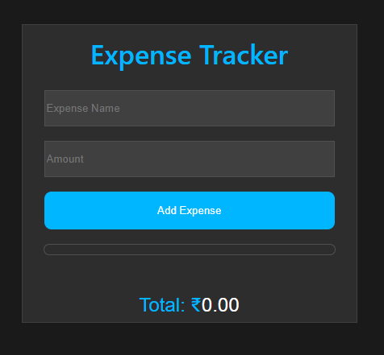
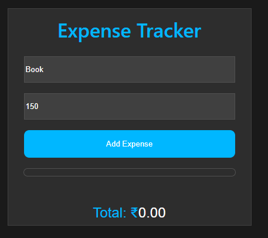
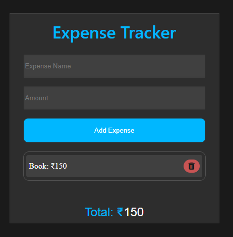
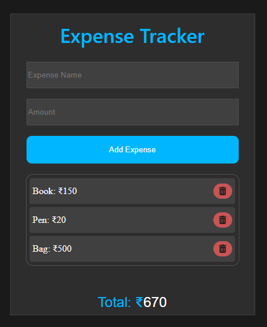

# 💰 Expense Tracker

**Author:** Mr. Manoj  
**Description:** A simple and lightweight web-based project to manage and calculate your daily expenses.  
You can add items with names and amounts, view them in a list, and see your total expense automatically update in real-time.

---

## 🧭 Overview

**Expense Tracker** helps you keep track of your spending in an organized way.  
You can manually enter your products or services along with their cost, and each entry will appear in a neat list with the total shown below.  

The project provides a clean, beginner-friendly design and works completely on the client side using HTML, CSS, and JavaScript.

The app contains **two main sections**:
1. **Before Clicking “Add Expense”** – the initial form view  
2. **After Clicking “Add Expense”** – the list view showing all items and total amount

---

## 📸 Screenshot — Overview

 


---

## 🚀 Key Features

- ➕ Add product name and amount easily  
- 💰 Auto calculate total expenses  
- 🗑️ (Optional) Delete individual items  
- ⚡ Real-time updates without refresh  
- 💻 Simple and responsive UI  
- 🪶 Lightweight and easy to use  

---

## 🧱 App Structure and Flow

---

### 🧩 Section 1 — Before Clicking “Add Expense”

This is the main input area where you can **enter your product name and amount** before adding it to the list.

**Fields:**
- Product Name  
- Amount  

**Actions:**
- **Add Expense Button** → adds the product and updates the total below

#### 📸 Screenshot — Before Adding Expense

 


---

### 🧾 Section 2 — After Clicking “Add Expense”

Once you click **Add Expense**, the product and amount will appear in a list format.  
The **Total Amount** shown at the bottom automatically increases as more items are added.

**Example:**
| Product | Amount |
|----------|---------|
| Book     | ₹150 |
| Pen      | ₹20 |
| Bag      | ₹500 |

**Total: ₹670**

#### 📸 Screenshot — After Adding Expense

 


---

## 🧩 Suggested File Structure

expense-tracker/  
├── index.html  
├── style.css  
├── script.js  
├── images/  
│   ├── Delete.png 
│   ├── overview.png  
│   ├── project1.png
│   ├── project2.png
│   └── Final.png
└── README.md  

---

## 🧠 Technologies Used

- **HTML5** → Structure  
- **CSS3** → Styling and layout  
- **JavaScript (ES6)** → Functionality and dynamic updates  

---


#### 📸 Screenshot — Final Expense Result

 

---

## ⚙️ How to Run

1. Clone the repository:
   ```bash
   git clone https://github.com/imanojz/Expense-Tracker.git

